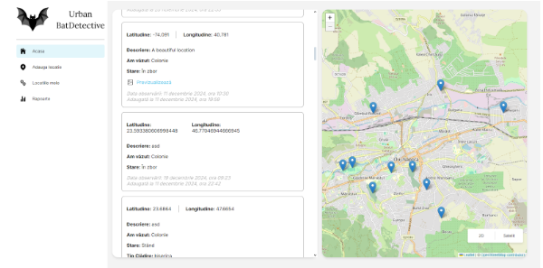

# BatDetective
Cartarea coloniilor de lilieci din zonele urbane/Bat Detective 

 

 

<h3>Descrierea Problemei </h3>
Identificarea și cartarea coloniilor de lilieci din mediul urban va permite protejarea liliecilor pe termen lung prin identificarea amenințărilor de tip proiecte de reabilitare termică a locuințelor, demolări, distrugere intenționată. Prin cartarea coloniilor se pot realiza acțiuni de educare și conștientizare pentru locuitorii din proximitate. 

<h3>Utilizatorii Aplicației</h3>
Aplicația va fi utilizată în primul rând de studenți, în cadrul unor lucrări/activități practice la discipline de ecologie/biologie și conexe, dar poate fi accesibilă publicului larg 

<h3>Ce ar trebui să facă aplicația?</h3>
Features:
<ul>
  <li>Colectarea automată a coordonatelor locației </li>
  <li>Colecatrea automată a datei și orei </li>
  <li>Afișarea unei hărți </li>
  <li>Colectarea de informații suplimentare – detalii </li>
  <li>Transmiterea  si stocarea datelor intr-un server </li>
  <li>Generarea de rapoarte centralizate, care să cuprindă, de exemplu, toate locațiile înregistrate in Cluj-Napoca, precum și analiza datelor </li>
  <li>Accesul la baza de date pentru cercetător </li>
  <li>Permiterea exportului de date într-un format utilizabil pentru rapoarte științifice, excel, shp</li>
</ul>

<h3>Platforma dorită</h3>
<ul>
  <li>Telefon mobil pentru utilizatori </li>
  <li>Telefon și laptop/PC pentru cercetător </li>
</ul>
